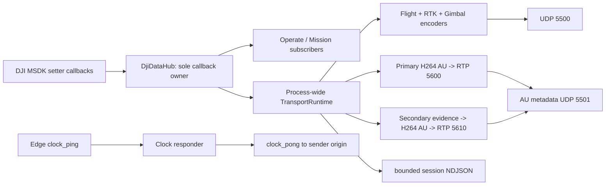
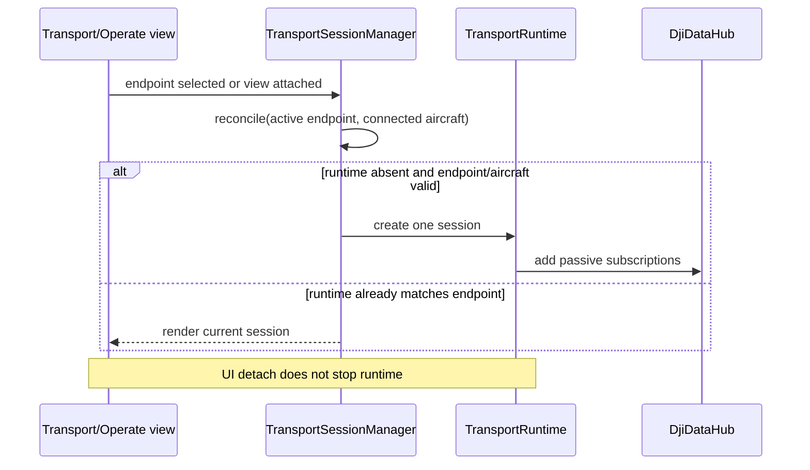
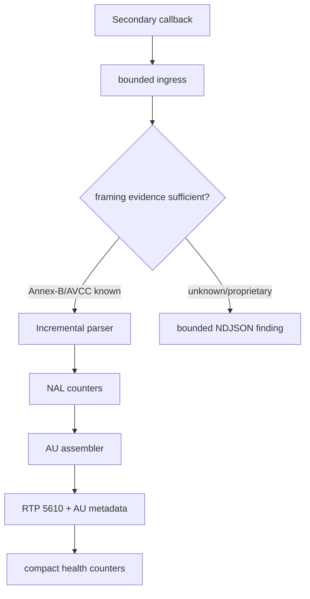

# fix: Make Android edge transport persistent and minimal

## Goal Capsule

- **Objective:** The Android operator app continuously supplies Ubuntu with a small, valid, low-latency pose/video transport session whenever a selected Edge endpoint and connected aircraft exist, while preserving Primary video and making FPV diagnosable to a hardware verdict.
- **Means:** Keep one process-wide `TransportRuntime` subscribed to `DjiDataHub`; replace oversized/chunked telemetry with typed bounded datagrams, retain RTP unchanged, and make UI a configuration/status surface rather than a transport owner. (KTD1, KTD2)
- **Authority:** The operator explicitly selects the Edge endpoint; the app starts passive broadcasting automatically thereafter. Only an explicit removal/change of the active endpoint or process termination may end that session. No flight, gimbal, mission, RTH, or landing command is introduced.
- **Stop conditions:** Do not claim FPV fixed from compilation. Stop for user direction if live capture proves the secondary source is not H.264 or cannot be mapped to DJI `VideoStreamSource.Fpv` without changing the receiver contract.

---

## Product Contract

### Summary

The Android-to-Ubuntu path currently proves Primary RTP end-to-end, but has three independent failures: DJI Home readback does not promptly update Mission state, passive transport appears disabled after navigation, and FPV receives DJI callbacks but reaches neither access-unit nor RTP emission.

The transport must become a deliberately narrow operational interface: GPS/RTK pose, gimbal pitch, compact health, access-unit timing metadata, and a clock responder. It must not keep sending generic diagnostic or aircraft-state inventories merely because they are available on the tablet.

### Problem Frame

An operator cannot trust the map, path, or FPV monitor when the tablet silently stops forwarding on a page transition, serializes invalid UDP JSON, or leaves the receiving system unable to distinguish a missing FPV source from a parser failure.

The current generic telemetry model expands a small navigation requirement into chunked packets and unrelated state, which adds failure surface and makes the Edge contract harder to validate.

### Requirements

- R1. Selecting an Edge IP as `IN USE` enables passive transport by default; navigation between Operate, Mission, and Transport must neither stop nor visually reset it.
- R2. The Transport screen must be a compact endpoint/status screen without a start/stop toggle. It may show that it is waiting for an aircraft or endpoint, but does not own the runtime lifecycle.
- R3. A completed `SET DJI HOME` action must update Mission's displayed DJI Home and preflight state immediately from the confirmed coordinate, then later reconcile with `DjiDataHub` state without replacing a confirmed valid Home with a stale unavailable snapshot.
- R4. UDP 5500 carries only one unfragmented valid UTF-8 JSON datagram per Flight Controller, RTK, gimbal, or health sample. It must contain neither `NaN`/`Infinity` nor fields outside R5-R8.
- R5. `flight` is `v`, `type`, `session`, `stream`, `seq`, `rx_mono_ns`, and `data.fields` containing only `aircraft.latitude_deg`, `aircraft.longitude_deg`, `aircraft.altitude_m`, and `heading_deg`, each as `{value, valid}`.
- R6. `rtk` has the same envelope and contains only `fusion.latitude_deg`, `fusion.longitude_deg`, and `is_being_used`; invalid fusion coordinates use JSON `null` and `valid:false`. RTK absence never suppresses Flight fallback.
- R7. `gimbal` has the same envelope and contains only `attitude.pitch_deg`; it is passive and does not cause a gimbal command.
- R8. `health` is emitted at 1 Hz on UDP 5500 with only the stated session counters: video callbacks/drops, access units, RTP packets, telemetry queue drops, telemetry socket errors, and video socket errors.
- R9. UDP 5501 sends exactly one compact `video_au` record per complete Primary or FPV access unit with session, feed (`primary` or `fpv`), frame sequence, SSRC, RTP timestamp, and first/complete Android monotonic receive times. RTP ports 5600/5610 and payload type 96 remain unchanged.
- R10. UDP 5502 must reply immediately to an Edge-originated `clock_ping` using the sender IP and source port, preserving its correlation fields and adding Android `elapsedRealtimeNanos` receive/transmit timestamps. It must not require a preconfigured hard-coded host.
- R11. Secondary diagnostics remain bounded, session-separated NDJSON local to Android during investigation. Parser detail must not be sent in health or other network telemetry.
- R12. FPV investigation must prove each stage independently: DjiDataHub secondary delivery, byte framing classification, emitted NALs, emitted access units, and RTP packet count. Primary behavior must remain unchanged.
- R13. All sequence counters are non-regressing within a transport session, all JSON datagrams are at most 1200 bytes, queues remain bounded, and DJI callback threads remain non-blocking.

### Key Decisions

- KTD1. **Endpoint-selected autostart over a user toggle** (session-settled: user-directed — chosen over manual per-screen activation: leaving a page must never disable passive broadcasting). Governs R1, R2, R13.
- KTD2. **Minimal typed transport contract** (session-settled: user-directed — chosen over forwarding full aircraft diagnostics: ROS map/path requires only pose fallback, RTK XY, pitch, health, frame timing, and clock). Governs R4-R11.
- KTD3. **Keep encoded RTP and its ports unchanged** (session-settled: user-directed — chosen over changing the receiver protocol: Primary already works end-to-end and port changes lack evidence). Governs R9, R12.
- KTD4. **Local FPV evidence, network-minimal health** (session-settled: user-directed — chosen over sending parser dumps to Ubuntu: diagnostics must not burden the live path). Governs R8, R11, R12.

### Key Flows

- F1. **Endpoint activation:** Operator selects an Edge IP as `IN USE` → preference change is observed by the process-wide manager → a connected aircraft starts one runtime → later views render its same session rather than recreate it.
- F2. **Pose fallback:** Hub Flight callback emits a small `flight` record → Hub RTK callback emits a small `rtk` record when available → Edge chooses valid RTK XY only when `is_being_used`, otherwise valid Flight XY; Flight altitude remains Z.
- F3. **FPV evidence:** Hub secondary callback enters a bounded sender → parser/assembler yields an access unit → RTP is packetized to 5610 and compact metadata goes to 5501 → local NDJSON retains diagnostic counters for the session.
- F4. **DJI Home:** Operator confirms `SET DJI HOME` for a waypoint → DJI completion succeeds → Mission uses that exact confirmed coordinate immediately → a later hub snapshot either matches/replaces it with current valid DJI state or remains unavailable without regressing the confirmed state.

### Success Criteria

- A live bench session has a single stable transport session across Operate → Mission → Operate, continuing UDP and Primary counters without an explicit operator stop control.
- Every received Android UDP datagram validates as JSON and remains at or below 1200 bytes.
- Edge receives gimbal pitch, usable Flight fallback pose, RTK when the aircraft provides it, clock pongs, and compact health.
- FPV is either proven end-to-end (`secondary_access_units > 0`, `secondary_rtp_packets > 0`, Edge 5610 packets and image) or produces a bounded local diagnostic conclusion identifying its failed stage.

### Scope Boundaries

- **In scope:** Android code, Android unit/contract tests, debug APK installation and user-run hardware checks.
- **Out of scope:** Changes to Ubuntu Edge/ROS implementation, dashboard/RViz redesign, ports/payload types, decode/re-encode, flight-control commands, or a guessed replacement codec/protocol.
- **Deferred to Follow-Up Work:** Persisted evidence retention policy on Edge, raw RTP capture controls, and any Edge-side schema migration beyond consuming the stated contract.

---

## Planning Contract

### Key Technical Decisions

- KTD5. **Split transport production by fixed record type, not generic telemetry chunks.** Replace `TelemetryEvent`-driven arbitrary field maps on the wire with small immutable Flight, RTK, Gimbal, Health, and AU metadata encoders. Generic diagnostics may remain local only. This makes wire inclusion auditable and makes an oversize datagram a programming error rather than a truncation condition. (Implements KTD2.)
- KTD6. **Manager owns policy and runtime; views only edit endpoint/render state.** The active endpoint becomes the persistent opt-in. `TransportView` has no switch and never calls `stop`; `OperateMvpView` and endpoint selection request idempotent reconciliation. Application/process teardown remains the normal close boundary. (Implements KTD1.)
- KTD7. **Confirmed DJI Home is a distinct short-lived state.** Mission displays the successful `setHomeLocation` callback immediately and retains it until hub readback is valid/current or a real product/session change invalidates it. This prevents UI freshness ordering from turning a successful command into `HOME UNAVAILABLE`.
- KTD8. **FPV parser classification is evidence-first.** Preserve Annex-B and the stateful AVCC parser, add bounded first-sample/framing evidence, and only alter parser interpretation after recorded input proves a mismatch. The assembler/RTP layer is not changed before its inputs are proven. (Implements KTD3, KTD4.)
- KTD9. **Clock responses follow the received datagram origin.** The UDP listener responds to the source socket address, not a fixed configured port, so the Edge controls request/reply routing and can synchronize across endpoint changes.

### High-Level Technical Design







### Assumptions and Deferred Implementation Questions

- The active Edge IP is currently stored in Android preferences; implementation will decide whether an endpoint edit while running restarts the runtime atomically or requires selecting a replacement `IN USE` endpoint. It must never silently broadcast to both.
- The exact DJI M210 FPV byte framing remains hardware-dependent. Tests can prove parser behavior with fixtures, but the physical bench capture determines whether Annex-B/AVCC is sufficient or a DJI framing adapter is required.
- RTK callbacks may be absent in a bench without active RTK. That is an expected unavailable signal, not evidence that the hub subscription is broken.
- Mission Home UI can be unit/instrumentation characterized without aircraft, but confirmation/readback timing needs a connected aircraft validation.

### Sequencing

First establish the minimal schema and its pure tests. Then make lifecycle and Home state deterministic against those stable seams. Only then instrument and repair FPV so parser changes are measured without telemetry noise. Finish with device/Edge verification that separates local, network, and hardware evidence.

---

## Implementation Units

### U1. Lock down the minimal wire schema and safe JSON encoding

- **Goal:** Replace generic/chunked Android network telemetry with explicit compact records for Flight, RTK, gimbal pitch, health, video AU metadata, and clock payloads.
- **Requirements:** R4-R10, R13; KTD2, KTD5, KTD9.
- **Dependencies:** None.
- **Files:** Modify `Sample Code/app/src/main/java/com/dji/sdk/sample/transport/network/JsonWireEncoder.java`, `Sample Code/app/src/main/java/com/dji/sdk/sample/transport/network/TelemetryUdpSink.java`, `Sample Code/app/src/main/java/com/dji/sdk/sample/transport/network/AndroidClockResponder.java`, `Sample Code/app/src/main/java/com/dji/sdk/sample/transport/network/TransportConfig.java`; add/modify `Sample Code/app/src/test/java/com/dji/sdk/sample/transport/network/JsonWireEncoderTest.java` and clock tests adjacent to it.
- **Approach:** Introduce one typed encoder entry point per record type. Centralize JSON scalar quoting/null/finite validation and serialize values before any socket enqueue. Remove chunk fields, generic component indexes, rate inventories, parser counters, battery, home, flight state, velocities, non-pitch gimbal fields, calibration, vision, and ultrasonic fields from the network contract. Make the clock responder parse only `clock_ping`, preserve correlation, and reply to the received socket address.
- **Execution note:** Start with characterization tests for every currently accepted outbound record, then make the old generic encoder unreachable from the UDP path.
- **Test scenarios:**
  - Flight with valid finite coordinates/altitude/heading yields one JSON object with only the four allowed fields and a monotonic stream sequence.
  - Invalid coordinate or non-finite numeric input yields `null` plus `valid:false`, never invalid JSON tokens.
  - RTK emits only fusion latitude/longitude and `is_being_used`, including unavailable coordinates.
  - Gimbal emits only pitch, including an unavailable attitude.
  - Health has exactly the required counters, no rate snapshots or parser structure, and fits 1200 bytes.
  - Primary and FPV AU metadata differs only by feed/values and excludes legacy fields such as physical source, NAL/IDR details, byte counts, and RTP sequence range.
  - Clock ping with arbitrary sender address/port produces a matching pong to that same origin with ordered monotonic timestamps.
  - Quoted strings, null values, and invalid numbers cannot yield malformed JSON.
- **Verification:** Contract tests parse each byte payload with a JSON parser, assert byte budgets and exact field allowlists, and verify no UDP sender receives a chunk list.

### U2. Narrow hub-to-transport telemetry collection

- **Goal:** Produce only the typed Flight, RTK, and gimbal-pitch samples required by the minimal contract while retaining `DjiDataHub` as the sole DJI callback owner.
- **Requirements:** R4-R8, R13; KTD2, KTD5.
- **Dependencies:** U1.
- **Files:** Modify `Sample Code/app/src/main/java/com/dji/sdk/sample/transport/telemetry/DjiTelemetryCollector.java`, `Sample Code/app/src/main/java/com/dji/sdk/sample/transport/telemetry/TelemetrySink.java`, `Sample Code/app/src/main/java/com/dji/sdk/sample/transport/telemetry/CompositeTelemetrySink.java`, related transport model classes only if they remain useful for local diagnostics; modify/add `Sample Code/app/src/test/java/com/dji/sdk/sample/transport/telemetry/DjiTelemetryCollectorTest.java` and `Sample Code/app/src/test/java/com/dji/sdk/sample/transport/TelemetryHealthTest.java`.
- **Approach:** Reduce the collector at its source rather than filtering an oversized map later. Preserve received Android monotonic timestamps and independent per-stream counters (`flight:0`, `rtk:0`, `gimbal:<index>` or the chosen documented active gimbal stream). Remove battery emission entirely from transport. Keep any richer callback observation only in bounded local diagnostics when it serves the FPV investigation.
- **Test scenarios:**
  - A valid Flight Controller state emits exactly the four Flight fields at callback cadence.
  - A valid RTK state emits exactly fusion coordinates and use flag; unavailable RTK does not block later Flight emission.
  - A gimbal callback emits pitch only and does not emit a packet for roll/yaw/calibration changes alone.
  - Repeated callbacks advance each stream sequence without cross-stream regression.
  - Collector start/stop subscribes/unsubscribes only to `DjiDataHub`, and callback ownership verification still passes.
- **Verification:** Pure collector tests plus the repository callback-ownership verifier demonstrate no new direct DJI setter callback and no network field outside the explicit allowlists.

### U3. Make transport endpoint policy persistent and view-independent

- **Goal:** Remove the transport toggle and ensure one selected endpoint causes automatic passive transport for any connected aircraft across all app pages.
- **Requirements:** R1, R2, R13; KTD1, KTD6.
- **Dependencies:** U1, U2.
- **Files:** Modify `Sample Code/app/src/main/java/com/dji/sdk/sample/transport/TransportSessionManager.java`, `Sample Code/app/src/main/java/com/dji/sdk/sample/transport/ui/TransportView.java`, `Sample Code/app/src/main/java/com/dji/sdk/sample/operate/OperateMvpView.java`, relevant layout/string resources under `Sample Code/app/src/main/res/`; add `Sample Code/app/src/test/java/com/dji/sdk/sample/transport/TransportSessionManagerTest.java` and UI/lifecycle characterization coverage where supported.
- **Approach:** Delete the operator-enabled preference and switch UI. Treat a nonempty validated `ACTIVE_IP` as intent to broadcast, and make manager reconciliation idempotent from product connection and endpoint selection events. Preserve the existing runtime when the endpoint is unchanged; make endpoint removal or replacement a deliberate state transition with a visible status. Never couple `View.onDetachedFromWindow` to runtime close.
- **Test scenarios:**
  - No active endpoint means no runtime and an actionable configuration status.
  - An active endpoint plus disconnected aircraft shows waiting, then starts once a connected aircraft is supplied.
  - Opening/closing Transport and switching Operate → Mission → Operate preserves the same running runtime/session.
  - Re-rendering Transport never displays an inactive state when the manager is running.
  - Selecting a different endpoint follows the documented atomic transition and does not duplicate active runtimes.
  - Removing the active endpoint is the only normal UI action that stops transport; page navigation is not.
- **Verification:** Manager tests prove lifecycle transitions; a tablet bench verifies session ID and packet counters remain continuous through page navigation.

### U4. Reconcile confirmed DJI Home with Mission state immediately

- **Goal:** Prevent a successful `SET DJI HOME` callback from leaving Mission at `HOME UNAVAILABLE` until an unrelated later status update.
- **Requirements:** R3; KTD7.
- **Dependencies:** None.
- **Files:** Modify `Sample Code/app/src/main/java/com/dji/sdk/sample/operate/MissionMvpView.java`, `Sample Code/app/src/main/java/com/dji/sdk/sample/djihub/DjiDataHub.java` only if it needs a timestamped/readback-friendly Home snapshot, `Sample Code/app/src/main/java/com/dji/sdk/sample/missionplanner/MissionPreflight.java`, and `Sample Code/app/src/main/java/com/dji/sdk/sample/missionplanner/map/MapLibreMissionMapView.java`; add/modify `Sample Code/app/src/test/java/com/dji/sdk/sample/operate/MissionMvpViewTest.java` and `Sample Code/app/src/test/java/com/dji/sdk/sample/missionplanner/MissionPreflightTest.java`.
- **Approach:** Model command-confirmed Home separately from passive hub Home freshness. On successful DJI completion, apply coordinate, availability, map marker, title, and preflight result on the UI thread in one render pass. Accept a later valid hub snapshot as authoritative; ignore stale/unavailable snapshots that precede or conflict with the currently confirmed session coordinate until a real disconnect/session reset.
- **Test scenarios:**
  - Successful set-home immediately changes title/status to ready, renders the map Home marker, and makes preflight use the confirmed coordinate.
  - Failed DJI completion leaves prior Home/preflight unchanged and surfaces the error.
  - A stale unavailable hub snapshot after success cannot regress Home to unavailable.
  - A later valid hub snapshot replaces the confirmed coordinate and keeps Home ready.
  - Disconnect/reconnect clears confirmed Home and requires fresh aircraft evidence.
- **Verification:** View-model/unit coverage proves the race ordering; hardware validation checks successful DJI command/readback with a connected aircraft.

### U5. Isolate FPV framing evidence and complete the Android RTP chain

- **Goal:** Turn secondary callbacks into either packetized FPV RTP or a concise local proof of the exact stage preventing it.
- **Requirements:** R9, R11-R13; KTD3, KTD4, KTD8.
- **Dependencies:** U1, U3.
- **Files:** Modify `Sample Code/app/src/main/java/com/dji/sdk/sample/transport/TransportRuntime.java`, `Sample Code/app/src/main/java/com/dji/sdk/sample/transport/network/VideoStreamSender.java`, `Sample Code/app/src/main/java/com/dji/sdk/sample/transport/video/AnnexBParser.java`, `Sample Code/app/src/main/java/com/dji/sdk/sample/transport/video/EncodedVideoRtpPipeline.java`, `Sample Code/app/src/main/java/com/dji/sdk/sample/transport/diagnostics/AsyncNdjsonDiagnosticWriter.java`, and `Sample Code/app/src/main/java/com/dji/sdk/sample/transport/diagnostics/JsonEncoder.java`; modify `Sample Code/app/src/test/java/com/dji/sdk/sample/transport/video/TransportPrimitivesTest.java` and add focused `AnnexBParserTest.java`/`VideoStreamSenderTest.java` as needed.
- **Approach:** Keep Primary’s proven pipeline unchanged. For Secondary, retain bounded counts plus a small capped sample of initial callback prefixes and framing signatures in session NDJSON. Verify source association with `DjiDataHub.Feed.SECONDARY` and display decoder association with `UsbAccessoryService.VideoStreamSource.Fpv`; classify Annex-B versus stateful AVCC before changing parse semantics. Emit only compact AU metadata on UDP after successful RTP packetization.
- **Execution note:** Characterize all existing parser behavior before changing it. Do not infer framing from callback count or use UI decode success as proof of transport framing.
- **Test scenarios:**
  - Primary Annex-B retains existing NAL/AU/RTP behavior and metadata to UDP 5501.
  - AVCC supports a complete NAL, multiple NALs in one callback, 1/2/3-byte split prefixes, split payloads, and prefix-plus-next-NAL boundaries.
  - Invalid/zero/oversize AVCC lengths reset bounded state and recover on later valid Annex-B or AVCC input.
  - Discontinuity clears partial parser/assembler state and does not create a false marker frame.
  - SPS/PPS plus IDR produces a packetizable AU; non-VCL does not produce a false AU marker.
  - Secondary diagnostics are capped/local and do not appear in health datagrams.
  - Secondary `video_au` appears only after a complete AU/RTP mapping and uses `feed:"fpv"`, RTP 5610, payload type 96.
- **Verification:** Unit fixtures exercise all framing boundaries; a physical session records counters for callback, NAL, AU, RTP and confirms whether 5610 receives packets.

### U6. Make session evidence and health truthful but small

- **Goal:** Separate live health from local evidence, create a new NDJSON file per transport session, and expose only counters needed to locate loss across Android and Edge.
- **Requirements:** R8, R11, R13; KTD2, KTD4.
- **Dependencies:** U1, U2, U5.
- **Files:** Modify `Sample Code/app/src/main/java/com/dji/sdk/sample/transport/TransportRuntime.java`, `Sample Code/app/src/main/java/com/dji/sdk/sample/transport/diagnostics/AsyncNdjsonDiagnosticWriter.java`, `Sample Code/app/src/main/java/com/dji/sdk/sample/transport/diagnostics/JsonEncoder.java`, `Sample Code/app/src/main/java/com/dji/sdk/sample/transport/network/TelemetryUdpSink.java`; modify/add `Sample Code/app/src/test/java/com/dji/sdk/sample/transport/diagnostics/AsyncNdjsonDiagnosticWriterTest.java` and `Sample Code/app/src/test/java/com/dji/sdk/sample/transport/network/TelemetryHealthTest.java`.
- **Approach:** Generate one UUID session directory/file and attach local diagnostics to that session without append-only mixing. Emit health at 1 Hz from runtime counters, not callback-rate snapshots. Retain only bounded rate/framing diagnostics local enough to distinguish callback ingress, queue drop, parser, AU, RTP, socket, and telemetry enqueue failures.
- **Test scenarios:**
  - Consecutive runtime sessions create separate NDJSON destinations and cannot mix records.
  - Health exposes the exact required counter names and nothing else.
  - Parser diagnostic growth is bounded under malformed input and omitted from network health.
  - Telemetry queue/socket errors and video socket errors increment the appropriate health counters without blocking a callback.
  - Health intervals are approximately one second under a controllable clock without producing duplicate sequence values.
- **Verification:** Local tests inspect files/counters; a bench compares Android health counters with Edge receive counters before and after the network.

### U7. Run layered validation and hardware-gated acceptance

- **Goal:** Prove each correction without turning build success into a claim of flight or FPV success.
- **Requirements:** R1-R13.
- **Dependencies:** U1-U6.
- **Files:** Modify `Sample Code/app/src/test/java/com/dji/sdk/sample/transport/TransportPrimitivesTest.java`, `Sample Code/app/src/test/java/com/dji/sdk/sample/missionplanner/MissionPlannerUnitTestSuite.java`, `scripts/test_android.sh`, and documentation in `docs/PLAN.md` or the current operator guide only to record verified evidence and remaining hardware gates.
- **Approach:** Run local contract tests first, then debug APK checks, then a passive tablet/Edge bench with no command issuance. Capture one evidence folder per session and compare Android counter values against Edge observations at named checkpoints. Treat `clock.ready` as a separate acceptance gate requiring configured host/ping response rather than inferring latency from timestamps alone.
- **Test scenarios:**
  - Full suite passes while preserving DJI callback ownership and Primary RTP primitives.
  - APK contains expected native video libraries and launches on the tablet.
  - With active endpoint and aircraft, transport starts without opening Transport UI and survives both page transitions.
  - Edge validates every UDP JSON record, receives clock pongs, and sees compact gimbal pitch/Flight/RTK as available.
  - Primary remains ~existing behavior; Android/Edge counters identify any RTP gap boundary.
  - FPV acceptance requires `secondary_video_callbacks > 0`, `secondary_access_units > 0`, `secondary_rtp_packets > 0`, UDP 5610 bytes, Edge access units/FPS, and visible FPV; otherwise the session NDJSON identifies the first zero/non-progressing stage.
  - RTK bench distinguishes unavailable RTK from malformed/missing transport data, and Flight GPS fallback continues path updates.
- **Verification:** Hardware evidence is recorded as code-ready versus end-to-end proven, with no claim beyond the observed counters and image.

---

## Verification Contract

| Gate | Applies to | Evidence of success |
|---|---|---|
| `scripts/test_android.sh` | U1-U7 | JSON, parser, mission, hub ownership, and health tests pass offline. |
| `scripts/build_android.sh :app:assembleDebug` | U1-U7 | Java 11 debug APK builds. |
| `scripts/verify_apk.sh` | U1-U7 | APK structure and required native video libraries validate. |
| Static wire allowlist audit | U1-U6 | No network path references removed telemetry types/chunk fields. |
| Tablet launch smoke | U3, U4, U7 | App registers/opens without crash; no aircraft command is issued. |
| Passive Android/Edge bench | U3, U5-U7 | Per-session counters and NDJSON prove lifecycle, valid JSON, clock, Primary, fallback pose, RTK availability state, and FPV stage. |

---

## Definition of Done

- The code has no transport enable toggle and an active Edge endpoint is the persistent passive-broadcast policy.
- Leaving or returning to Transport/Mission/Operate cannot create, stop, or visually misrepresent a running transport session.
- Mission applies a confirmed DJI Home immediately, with a tested stale-readback reconciliation rule.
- UDP 5500/5501/5502 exact schemas match R5-R10; all payloads parse as JSON and respect the 1200-byte limit.
- No battery, non-pitch gimbal data, detailed flight state, home, limits, vision, ultrasonic, calibration, velocity, parser diagnostics, or chunk metadata crosses Android’s live transport boundary.
- Primary RTP remains functional on 5600 with payload type 96.
- FPV code is marked only as hardware-ready until a bench proves Android access units/RTP and Edge image; failure evidence identifies the earliest broken stage without unbounded logging.
- Tests, build, APK verification, and callback-ownership checks pass; abandoned parser/telemetry code paths are removed rather than left as competing live behavior.

## Appendix

### Fixed external wire examples

```json
{"v":1,"type":"flight","session":"<uuid>","stream":"flight:0","seq":7,"rx_mono_ns":123,"data":{"fields":{"aircraft.latitude_deg":{"value":-23.5,"valid":true},"aircraft.longitude_deg":{"value":-46.6,"valid":true},"aircraft.altitude_m":{"value":12.3,"valid":true},"heading_deg":{"value":180.0,"valid":true}}}}
```

```json
{"v":1,"type":"gimbal","session":"<uuid>","stream":"gimbal:0","seq":3,"rx_mono_ns":123,"data":{"fields":{"attitude.pitch_deg":{"value":-45.0,"valid":true}}}}
```

```json
{"v":1,"type":"video_au","session":"<uuid>","feed":"fpv","frame_seq":9,"rtp_ssrc":123,"rtp_ts":456,"au_first_byte_rx_mono_ns":123,"au_complete_rx_mono_ns":124}
```
